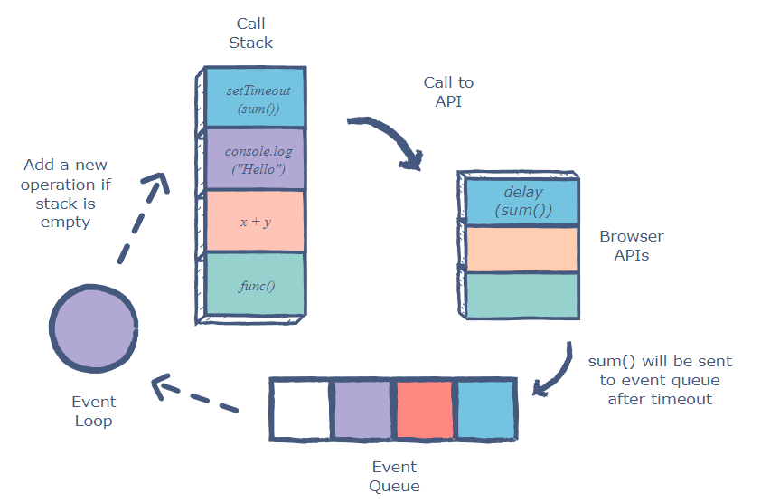

## Pro

### 1. EventLoop

- As we know JS is single threaded,still the UI never stucks
- which means when a program is loaded on webBrowser / runtime jsexecutes line by line, yet can handle multiple operationssimultaneously where it behaves asynchrously enabling the nonBlocking behaviour.
- Ex.:

  ```javascript
  const one = () => console.log("First");
  const two = () => setTimeout(() => console.log("Second"), 1000);
  const three = () => console.log("Third");
  two();
  one();
  three();
  ```

  

- The main key components are
  - callStack, follows LIFO
  - Heap, where memory is allocated dynamically. Ex Objects,arrays etc..
  - Queue, (TaskQueue) where async tasks waits to get executed.setTimeout, I/O operations etc..
  - EventLoop
  - So what happens is, the order of execution is imp.. Let's see the journey of the event loop execution.
    - the 1st line having <code>console.log('First)</code> is pushed to callstack and executed and logs
    - setTimeout, is 1st moved to the callstack, then moved to BrowserAPI. Here, from BrowserAPI it again being pushed tothe microTaskQueue which is kept ready to be executed aftera specified delay.
    - <code>console.log('Third);</code> is pushed to the callstack, executed and logs 'Third'
    - Here, once the callstack is empty The eventLoop checks the microtask queue finds the setTimeout() callback and executes logging "Second".

### 2. Hoisting & TemporalDeadZone

- where JSEngine, just memory loading phase before the execution (It does not executes any code there), where the every line of code is being scanned before the actual execution.
- While loading if it gets across the

  - function, it stores the refrence/definition of the function.
  - let/const, keeps the variables <strong>uninitalized</strong>
  - var, undefined

- Ex.: If we try to access the

  - Function before declaration, We dont get any issue or error as the refrence of the function is already being loaded, we can execute the function at any place at ant time.
  - Let/const before declaration, we get RefrenceError ()
  - var before declaration, we gets undefined

- TEMPORAL DEAD ZONE : generally seen in let& const,
  - it is the phase b/w entering into the scope and being declared where they cannot be accessed.
  - let & const are block-scoped, which means they are only accessible within the {}

### 3. Scope & ScopeChain

- accessiblity range of the variable,
  - Global Scope
    - Browser => window()
    - node => global => {}
  - Block Scope, functional scope => function(){}.
  - Local Scope
- scopeChain, chain of refrences.
  - where JS continuously hunts for the variable from LocalExecutionContext (LocalScope) till it reaches the GlobalExecutionContext.
  - This is always one way,
    - where only insider can go outside. Vice-versa is not possible.

### 4. Prototypal Inheritance and chaining.

- where we take something and extend it.
- linking of prototypes of a parent object to the child object to share and utilize its properties and methods of the parent class.

  - Ex.: .join, .length
  - prototypalInheritance, can be borrowed on String, Array, Objects
  - Single prototype, can inherit only 1class.
  - Multiple Inheritance, **proto**.**proto**

    - Object.create()
    - Object.getProtypeOf
    - Object.setPrototypeOf

    ```javascript
        // Before ES6
            let faang = {
                name:'google',
                salary:function()=>{
                    console.log('30K salary')
                }
            }
            let engineer = {
                empId=123,
                task:function(){
                    console.log('task assigned');
                }
            }
            engineer.__proto__=faang;   // engineer inherits all the properties of faang
            console.log(engineer);
            engineer.salary()


        // After ES6
            let faang={
                name:"google",
                salary:function(){
                    console.log("40K salary");
                }
            }
            let engineer = Object.create(faang, {
                taskAssigned:{value:2}
            })
            console.log(engineer)
    ```

- PropertyShadowing

  - name:"chai",
    **proto**:{name:"tea"} // bk.name="chai"
    **proto**: {**proto**:type:"ginger"} // bk.type = 'ginger'

  - shadowing, where a variable is declared within a nested scopeand has the same name as variable in its outer scope.
  - while getting the values it takes the available nearest value.

- MonkeyPatching
  - Do not add the customFunction name directly in the ArrayString or Object
  - Ex.: Array.prototype.customlength()
  - Becoz if somewhere down the line while writing the ES9 or ES10. If they use the same as yours then there would be condition of overwrite. Thus, your library/App may break.

### 5. Promises and Queues

- Promise, is a placeholder which represents the resolve or reject of an async Operation.

  ```javascript
      console.log(new Promise(()=>{}))
      // Returns below response,
          [[Prototype]]:Promise
          [[PromiseState]]:"pending"    // default State of promise
          [[PromiseResult]]:undefined   // default State of result
  ```

  - it always responds back with
    - State & Result
    - State is of 3 types
      - Pending
      - Rejected
      - fulfilled
  - this takes a callback function having 2 args : res, rej

    ```javascript
    new Promise((res, rej) => {
      console.log(res); // response, if success.
      console.log(rej); // rejection
    });
    ```

    > NOTE: new Promise(()=>{}), is a synchrous function till, we add .then(). So, async function will be as follows
    >
    > > new Promise(()=>{}).then()

  - If we get the data from API

    ```javascript
    getDataFromAPI(url)
      .then((data) => console.log(data))
      .catch((error) => console.log(error))
      .finally(() => console.log("All done---"));
    ```

    > We can always further chain of .then(), till we get the finally result.

    - Promise adds ansynchrous behaviour to js, by using .then() or .catch()
    - Methods, which directly goes to microtask queue or macroTask Queue

      - MacroTask (Timer Operations, FileRead, HTTP task..)

        - setTimeout
        - setInterval
        - setImmediate
        - I/O Operation
        - UI rendering
        - HTTP request

      - MicroTask (Have more Priority)
        - Promise handlers, .then(), .catch(), .finally()
        - queue Microtask()
        - Mutation Observer

    > If we tryto access the Http handlers or timeout operations in Promise, then it behaves as microTask queue.

    > callStack && microTask == empty, then it should execute the task queue.

    ```javascript
    console.log("Start!.."); // starts
    setTimeout(() => {
      // TimerMethod, goes to MacroTask Queue
      console.log("Timeout");
    }, 0);
    Promise.resolve("Promise!..").then((res) => {
      console.log(res);
    }); // MicroTask Queue
    console.log("End!.."); // Ends--

    // Response Of Above Code is Start, End, Promise, TimeOut -->
    ```

### 6. Async / Await

- Promise.resolve('chai') == async function tea(){ return "chai"} // yes, this is equal. If looking for await in async, it is equal to .then() in promise.
- await => makes the async function to wait in awaitedState till it returns the resolved promise.

  > After await, the rest of the async function gets moved to the microtask queue.
  > // Practice

  ```javascript
  const one = () => Promise.resolve("one"); // synchronous code

  async function test() {
    // Async function
    console.log("Inside Test Function----");
    const result = await one();
    console.log(result); // resolves and stores the value in result, As console.log() is after await. So, the result would wait in the microtask queue
  }
  console.log("Before calling Test function-------");
  test();
  console.log("After calling test function-----");
  ```

    <!-- Before calling the Test function ---,  Inside Test Function---, After calling the function---,   Now prints the result=> "one"-->

  ```javascript
      console.log("Script Start---")      //"1-----Starts"

      setTimeout(()=>{                        // Moves to MacroTask Queue
          console.log('setTimeout---')            // 8----
      }, 0 )

      new Promise((resolve, reject){              // Syncronous Code
          console.log("Promise Constructor--");   // 2---
          resolve("Promise Resolved")                 // 6-----
      }).then((res)=>{
          console.log(res)                        // MicroTask Queue
      })

      async function asyncFunc(){
          console.log("asyncFunc starts--")       // 3----
          await new Promise((resolve)=>{          //
              console.log("Promise inside AsyncFunc") // 4--
              resolve("async/await resolved----")         // 7-----
          })
          console.log("AsyncFunc Ends---")        // await, soo MicroTask Queue
      }

      asyncFunc();

      console.log('Script Ends---')               //5---
  ```

### 7. Closure

- closure, the combination of a function which is being bundled together with the refrences to its surrounding state.

  - A closure gives access to the outer function's scope from an inner function.
  - closure is created everytime a function is created, i.e function creation time.

  ```javascript
  function outer(x) {
    return function inner(y) {
      return x + y; // If the outerFunction is not refrenced, It is Garbage collected. Here it is refrenced so we can use its lexicalEnv Details.
    };
  }
  const result = outer(2);
  result(5);
  ```

  > NOTE: Inner Lexical Enviornment refers to the outer lexical enviornment. When the outer Lexical function is not refrenced, it is Garbage collected.

    <!-- Practice -->

  ```javascript
      const getValue = ()=>{
      let score = 10;
      return () => ++score;   // performs the operation before returning
      }
      const value = getValue();
      <!-- ! IMP -->
      console.log(value)  // stores the refrence of the return Function. Here, its does not use the previous value to perform the next operation. Rather, this copy whole of the function to other place performs the operation and returns the value.
      console.log(value())    // 11
      console.log(value())    // 12
  ```

  ```javascript
      const getValue = ()=>{
      let score = 10;
      return () => score++;   // performs the operation after return, so at first it returns the initial value before increasing.
      }
      const value = getValue();
      <!-- ! IMP -->
      console.log(value)  // stores the refrence of the return Function. Here, its does not use the previous value to perform the next operation. Rather, this copy whole of the function to other place performs the operation and returns the value.
      console.log(value())    // 10
      console.log(value())    // 11
  ```

  ```javascript
  function loadBalance() {
    let userBalance = 100;
    function addBalance() {
      let newValue = ++userBalance;
      return newValue;
    }
    return { addBalance }; // returns the full functional method of addBalance.
  }
  const balance = loadBalance(); // returns the reference of the function.
  console.log(balance.addBalance()); //101
  console.log(balance.addBalance()); // 102
  console.log(loadBalance().addBalance()); // 101
  ```

### 8. THIS

- provides the context of the function.

  - Its is generally based on which enviornment

    - Browser

      - it points to the window object,

    - Runtime such as Node, Bun, Deno etc..
      - It points to the global Object, generaly {}.

  - Regular Fn with this (IN BROWSER)
    ```javascript
    function getThis() {
      console.log(this);
    }
    const obj = {
      getThis,
    };
    getThis(); // gets WindowObject
    obj.getThis(); // refrence of the function.
    ```
  - Arrow Function in Browser
    ```javascript
    const getThis = () => {
      console.log(this);
    };
    const obj = {
      getThis,
    };
    getThis(); // gets WindowObject
    obj.getThis(); // gets WindowObject
    ```
  - ARROW Fn Vs REGULAR Fn in DOM

    ```javascript
    <!-- Regular Function -->
        button.addEventListner('click', function(){
            console.log(this)
        })
        button.click()  // whoever calls the this, have its own refrence. So, here it get the full refrence of button. <button>ClickMe</button>

    <!-- Arrow Function -->
        buttonTwo.addEventListner('click', ()=>{
            console.log(this)
        })
        buttonTwo.click()   // in ArrowFunction, this function gets the global Object Window..
    ```

### 9. Call, Apply and Bind

- call
  - immediately invokes a function with the specified "this"(getting from the function)
- Apply
  - same as call but args are passed as an array.
- Bind

  - returns a new function, when called has its own "this" value set to the provided value.

  ```javascript
      const person = {
          name:"Alice",
          age:25
      };
      function introduce(interest, hobby){
          console.log(`My name is ${this.name} and iam ${this.age} years old. I like ${interest} and ${hobby}`)
      }
      introduce.call(person, "math", "chess") // person is the context provided.
      <!-- Context can be any object, which cannot be called directly. We have to use call() -->

      introduce.apply(person,["science", "Badminton"])    // same as call, context has been provided and the args have been passed in the array.

      const boundIntroduce = introduce.bind(person, "literature");   // takes the copy of the original function. Here it passes the context and 1arg has been passed.
      boundIntroduce("writing")   // here, again it the 2nd args has been passed.
  ```

---

---

### 1. Is JS single threaded or multi threaded?

- JS is a single threaded, which means it has a callStack and a memoryHeap. This executes the code lineByLine.
- With the help of the runtimeEngines,on execution of specific functions such as setTimeout, promises etc..
  it behaves as nonBlocking and performs the async Operations (in the main thread itself)

### 2. Explain How JS Engine Works?

- JS engines are the programs which executes the JS code, these are generally found in web browsers and other env which hosts JS.
- Th most popular JS engines are Google V8, SpiderMonkey etc.. These engines are written in C++ and are used to execute JS code.
  

### 3. What is EventLoop in Javascript?

- Please refer above

### 4. Diff b/w var, let, const?

- var
  - scope of the variable is global.
  - default value of var is undefined.
- let
  - scope is limited to the "block" defined by the curly braces. i.e.{}
  - default value is unInitialized
- const
  - scope is limited to the "block" defined by the curl braces, {}.
  - default value of const is uninitialized.

### 5. Diff types of DataTypes in Javascript

- 2types of Javascript
  - Primitives
    - Strings, numbers, booleans, null, undefined, Symbol
  - Refrences
    - Objects, Arrays, Functions,etc...

### 6. Discuss Promise and PromiseChaining

- Promises are the way to handle the asynchronous operations in javascript, which allows to execute the code aynchronously, without blocking the main thread.
- Promises are executed using the <code>Promise</code> constructor, and can be chained using .then method.

- Promises have 3 states:
  - Pending, the async operation is still in progress.
  - fullfilled, operation has been completed successfully.
  - rejected, async operation has been failed.
- Promise, to perform an async operation It is being chained by using

  - .then, which takes 2args (successCallback & errorCallback).
    - the successCallback is called when the promise is fullfilled.
    - the errorCallback is called when the promise is rejected.

  ```javascript
  fetch("http://api.freeapi.app/v1/jokes/random").then((response) =>
    response.json()
  );
  ```

### 7. Async/ Await

- This is the syntax feature which allows us to write async code in more sync mode.
- It uses async and await keywords to define async functions.

- Ex.:

  ```javascript
  async function fetchData() {
    try {
      const response = await fetch("http://api.freeapi.app/v1/jokes/random"); // moves to microtask queue
      const data = await response.json(); // moves to microtask queue
      console.log(data);
    } catch (err) {
      console.log(err);
    }
  }

  fetchData()
    .then(() => console.log("Data Fetched--"))
    .catch((error) => console.log(error));
  ```

Here, the fetchData() is defined as an async func using <code>async</code> keyword.
The <code>await</code> keyword is used to wait for the fetch function to get the response before moving to the next line. Such that rest of the code after await is executed in microtask queue.

### 8. callback & callback hell in javascript

- callback function are the functions / methods which are being passed as an argument to other functions.
  ```javascript
  setTimeout(() => {
    console.log("Timeout");
  }, 1000);
  ```
- Ex.: 2

  ```javascript
  function readFile(filename, callback) {
    fs.readFile(filename, "utf8", (err, data) => {
      if (err) {
        return callback(err);
      }
      callback(null, data);
    });
  }

  readFile("file.txt", (err, data) => {
    if (err) throw err;
    console.log(data);
  });
  ```

- callback hell is a problem, where functions/callbacks are nested inside each other making the code difficult to read and understand.
- which leads the callbacks being called multiple times or not being called at all, causing an unexpected behaviour.
  ```javascript
      // Bad Code ---
      fetchRandomJoke(joke)=>{
          console.log(joke);
          translateJoke(joke, translation)=>{
              console.log(translation)
              writeToFile(translation, file)=>{
                  console.log("Joke written to the file")
                  sendToEmail(translation, email)=>{
                      console.log("Joke sent over Email")
                  }
              }
          }
      }
  ```
- This can be avoided using Async/Await or Promise
  ```javascript
  const fetchRandomJoke = async (joke) => {
    const joke = await fetchJoke();
    const translation = await translation(joke);
    await writeToFile(translation, file);
    await sendToEmail(translation, email);
  };
  ```

### 9. Diff b/w == and === in javascript?

- ==, compares the values of 2operands for equality (checks if operands are equal)
- ===, compares the values of 2operands for strict equality. (checks if operands are equal and of same type)

### 10. how to create the object in javascript

- Mainly we create objects using
  - object literals
    - enclosed in {}, and are usedto create objects with key-value pairs.
    ```javascript
    const person = {
      name: "Aawni",
      age: 28,
      city: "Osaka",
    };
    ```
  - constructor functions are used to create objects with custom properties & methods.
    ```javascript
    function Person(name, age, city) {
      this.name = name;
      this.age = age;
      this.city = city;
    }
    const person = new Person("Aawni", 28, "Osaka"); // constructor function using custom properties
    ```
  - Object.create()
  - etc..

##

### 11. Rest & Spread Operator

- Spread \_\_\_ used to spread the elements of an iterable(such as anArray or Object) into the individual elements

- Rest\_\_\_used to collect multiple elements and condense them in a single array, Often usedto handle an indefinite number of args.

  ```javascript
  function sum(...numbers) {
    // by using spread operator, we pack all the elements in an array.
    return numbers.reduce((total, number) => {}); // reduce, is the method which takes the array/Objects for performing any operations.
  }
  sum(1, 2, 3, 4, 5); // passed the args separately.

  // Spread Operator
  const arr1 = [1, 2, 3];
  const arr2 = [4, 5];
  const arr3 = [...arr1, ...arr2]; // this doesn't creates 2 array, becoz here, we are spliting the elements individually creating single array
  console.log(arr3); //[1,2,3,4,5]
  ```

  here, the sum() takes an array of Nos as an argument using the rest operator.
  The spread operator is used to expand the array into individual elements

### 12. Higher Order Function

- Higher Order function are the functions which takes other functions as an arguments or return the functions as an result.
- This allows to write more flexible and reusable code.
  ```javascript
  function funcOne(func, arg) {
    return func(func(arg));
  }
  console.log(funcOne(Math.sqrt, 16));
  ```

### 13. Closure

- Closure are the functions which have the access tothe variables from outer scope, even after the outer function has been finished executing.
  ```javascript
  function outerFunction() {
    const outerVariable = "This is an outer variable";
    function innerFunction() {
      console.log(outerVariable);
    }

    return innerFunction;
  }
  const closure = outerFunction()
  closure();  // This is an outer variable
  ```

### 14. Hoisting
- Hoisting, where we can use the variables & functions before they are being declared. this means we can use the variables and functions before they are defined in the code.
- Hoisting is done by the JS engine, which moves the declaration of the variables and fuctions to the top of their scope.
  ```javascript
    divideByTen(10)
    function divideByTen(x){
      console.log(x/10)
    }
  ```
### 15. Temporal Dead Zone
- where the let and const declarations are hoisted to the top of their scope, but it is not available immediately in the code. Which means we can use the variable before its declared.
- Here, the value of the variable will be undefined until it assigns a value.
  ```javascript
    console.log("x")  // RefrenceError : x is not defined
    let x = 5;  // moves its refrence to the top of the scope
    console.log(x)  // 5
  ```

### 16. Name some features of ES6 in javascript
- ES6 introduced in 2015, which includes arrow functions, template Literals, destructuring etc..
  - Arrow Function, which provides a more consise syntax for writing function ( => ).
  - Template Literal, which allows to embed the expressions inside strings/ backticks ( ` ` ).
  - Destructuring, which allows us to extract the values from arrays or objects and assign them to the variables using " = " operator.
  - spread operator, allows us to expand an array/ object into individual elements. It is used to pass multiple arrguments in a function.
  - classes, which provides a way to define objects with properties and methods.
  - Modules, allows us to split your code into separate the files and allows import/export functionality b/w them. It is defined using import & export keywords.
  - Promises, a way to handle async operations,
  - Map & Sets, data structures which allows us to store key-value pair using Map & Aet constructors.

### 17. Currying
- the  technique in functional programming which allows to transform a function which takes multiple arguments into a sequence of functions, each taking a single argument. Which is useful for creating more flexible and reusable code.
  ```javascript
    function add(x){
      return function(y){
        return x+y
      }
    }
    const addTwo = add(2)
    console.log(addTwo(3));
  ```
  Here, the add() takes a single argument 'x' and returns a new function which takes the single argument 'y' and returns the sum <x+y>.
  The addTwo() is created by calling add with the argument 2, Then the addTwo() is called with anyvalue of y, to get sum of 2 and y.

### 18. Arrow Function
- Arrow Function is the shorthand syntax for writing functions. This provides more consise and readable way to write the functions, Specifically while using anonymous function.
```javascript
  const add = (x,y) => x+y;
  console.log(add(2,3)) // 5
```
Here, the arrowFunction add takes 2 args x & y and returns their sum.
which is being defined using '=>' operator, the shorthand for function keyword.


### 19. Prototype
- prototype chain is the mechanism which allows the objects to inherit the properties from other objects.
- Its a way to share the behaviour b/w objects.
```javascript
  function Animal(name){
    this.name = name;
  }
  Animal.prototype.sayname = function(){  // injecting a sayName function into Animal()using prototype.
    console.log(this.name)
  }
  function Dog(name){
    Animal.call(this.name); // call, such as to pass the context of the Animal
  }

  // As the constructor might get overRide in this condition, So we need to fix/ reset the constructor to its initial state.
  Dog.prototype = Object.create(Animal.prototype);  // Object.create is used to create the object, Here it is used to change the constructor.
  Dog.prototype.constructor = Dog;

  const dog = new Dog("Retriever");
  dog.sayname(); // Retriever
```

### 20. Call, Apply, Bind
- call___used to call a function with a specific `this` value. It take 2 args, Function to be called & its value to use

- apply___used to call a function with a variable number of args.It takes 2 args, function to be called & an array of args to pass the function.

- bind___used to create the new function which when called has its own this value pre-bound to the specific object.this too takes 2 args, the function bound and the this value to use.

### 21. How to compare 2 objects in javascript
- using === operator, which checks if the 2 objects have the same value & dataType.

- If its JSON Object, we can convert an object to a string using `toString()` method. This method returns the string representation of the object.

### 22. Event Delegation
- the technique which allows us to attach the event listners to the parent element and handle the events for its child elements.
```javascript
  const parentElement = document.getElementById('parent')
  const childElement = document.getElementByClassName('child')  // className denotes, this might have many classes
  // So added forEach to loop over each className
  childElement.forEach((childEle)=>{
    childEle.addEventListner('click', handleClick); // addEventListner is the EventDelegation
  })

  function handleClick(event){
    console.log(`child Element clicked`)
  }
```

### 23. EventBubbling & EventCapturing
- EventBubbling
  - technique in javascript which allows us to handle events for child elements attaching event listners to the `parent element`.
  - This is used to create more flexible and reusable code.

- EventCapturing
  - which allows us to handle events for child elements by attaching the event listners to the `child element`.

### 24. ShallowCopy & Deep Copy
- Shallow Copy
  - is the copy of an object whose refrences are same. It creates a new object with the same properties as the original object.
  - On modification of the properties of new object, this will also modify the original object.

- Deep Copy
  - copy of an object which creates the new object with the same properties and values. It does not share the same refrences b/w the original Obj & the newObj.
  - On modification, the properties of newObj, it will not modify the original Object
```javascript
// Shallow Copy
  const person1 = {
    name:"Aawni",
    age : 28
  }
  const person2 = person1;
  person2.age = 30;
  console.log(person1.age) // 31

// Deep Copy
  const person1 = {name:"Aawni", age:28}
  const person2 = JSON.parse(JSON.stringify(person1))
  person2.age = 30
  console.log(person1.age)  // 28
```

### 25. IIFE
- which is invoked immedately after it is being defined. It is often used to create the private scope for variables & functions.
- Generally, used while creating database connection.
```javascript
(function(){
  // Private variables & Functions
  const name = "Aawni";
  function sayHello(){
    console.log(`Hello ${name}!`)
  }

// Public Functions
  function greet(){
    console.log(`Hello World!`)
  }
})();
```
- iife is invoked immediately after its defined.
- name variable & sayHello() are private to iffe. so, cannot be accessed from outside the iife.
- greet() is also private to iife, but cn be accessed from outside the iife.


